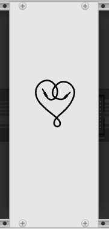
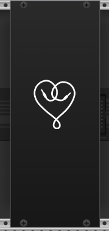

# VCV-Rack-modules
VCV Rack modules based on Modulove Eurorack hardware

Read about the modules here: https://modulove.io/#modules

# Udate

We plan on releasing a selection of our modules in 2025.

# Modules
## MVMNT
The first Module MVMNT is now in development

## BLANK
 

The first blank was done with the help of this [template](https://github.com/Paul-Dempsey/GenericBlank).

# Differences with hardware

# ToDo
Blank panels with design in 4 HP.

# Contributing
We welcome Issues and Pull Requests to this repository if you have suggestions for improvements.

# Donating
If you enjoy those modules you can support the development by making a donation: [DONATE](https://paypal.me/modulove).

Have fun!
